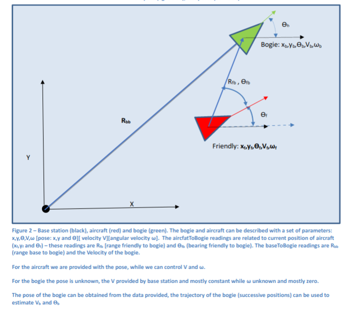

Quiz 4
======

Part A
------

We have been provided a simpler version of aircraft simulator, which does not encompass the threading aspects and control of friendly, rather just the radar simulation from the aircraft. Refer to class [Display](./a1/dep/include/display.h) for the functionality provided. The `Display` class allows us to select a number of `bogies` to be spawned in the `Airspace`, there locations will be random. 

We can invoke a `scan` function in the `Display` class, the function simulates an aircraft equipped with radar obtaining measurements (R and theta fro friendly to bogie) at the `Pose` supplied (friendly pose), the pose is the parameter of the function.  We will use these measurements and the `Pose` of our aircraft to compute the location (x,y relative to base) of the bogies, and vice-versa in our  [tf2 helper functions](./a1/tf2.h). Further we can use the aircraft pose and bogie location to compute *time to impact*, in the [Analysis Class](./a1/analysis.h) the time it will take for us to reach stationary bogies. Finally, we can create a graph connecting all bogies, with bogies as edges of the graph and the edge weight being distance between the bogies.  Exert from Assignment 2 specification below.



**TASK 1 - Local to Global Conversion**

The radar obtains range and bearing readings (polar coordinates) from the `Pose` supplied. Convert these measurements into Cartesian locations relative to (0,0) - the origin of the map (aka the base station location). 

**TASK 2 - Global to Local Conversion** 

If the bogie information was relative to (0,0) - the origin of the map (aka the base station location and the `Pose` of friendly supplied, compute the range and bearing of the bogie in the reference frame of the friendly. This is the exact opposite operation of TASK 1. 

**TASK 3 - Time to Impact**

For an aircraft to reach any of the goals it will need to obey the constraints (1) min velocity V_TERM (2) max velocity V_MAX and (3) max permissible angular velocity governed by the limits  OMEGA*V<= 6G. To reach any of the goals in the quickest time we can compute time to impact as a combination of (1) theoretically fastest turn - maximum angular velocity and (2) fastest speed - maximum liner velocity.

Therefore, for each goal the computation for time to impact has to take into account the distance and angle for each goal from the origin pose.

Implement the function that computes the time to impact for each of the targets (bogie) for the pose supplied (aircraft pose)

**TASK 4 - Create Graph**

Creates a graph of all goals (where goals are all nodes of the graph). All goals are interconnected (i.e. if number of nodes is N then each node is connected to N-1 nodes and therefore has N-1 edges).  Store graph using the `AdjacencyList` supplied in e [Analysis Class](./a1/analysis.h).  

In the graph, the outer vector contains an entry for all nodes ( like our Week 5 BFS/DFS example). The inner vector has edges a pair, where the pairs contain (1) a metric (we will use Euclidean distance between the nodes) - as first element (2) the node id the edge is connecting to - as second element

Part B
-------

The code supplied has two ROS nodes, and therefore you will need to have followed Week09 pre-work, which 

* Discusses installing ROS (you can skip this if your using our VM)
* Creating catkin_ws
* Compiling our week09 begginer tutorials (adding them to your catkin workspace)

You will now need to add the quiz4 part a2 once only inside your catkin workspace (my git is ~/git/pfms-2021s-alalemp change for your location of your git ), this is a one of process.

```
cd ~/catkin_ws/src
ln -s ~/git/pfms-2021s-alalemp/quizzes/quiz4/a2 .
```

Whenever you need to compile your code you need to be in folder `~/catkin_ws/`and if so, you can compile via `catkin_make` command, and this is done every time you change the code.

To run the two nodes through ROS  (talker and quiz4_a2) you need roscore running in one terminal vai command `roscore`

```
rosrun beginner_tutorials talker
rosrun quiz4_a2 quiz4_a2_listener
```

To check the unit test you run

```bash
rosrun quiz4_a2 utest
```

We need to implement two functions in our [analysis](./a2/src/analysis.h) 

**TASK 4 - Count characters**

Counts the number of characters in the string supplied 

**TASK 5 - Detect integer in string**

Detects a integer number which is part of the string supplied, detects the first number in the string.

