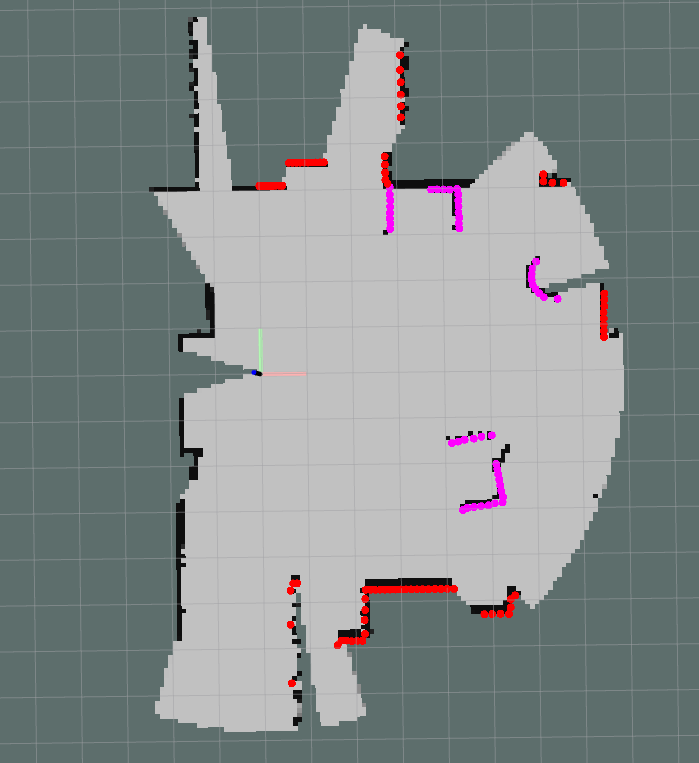
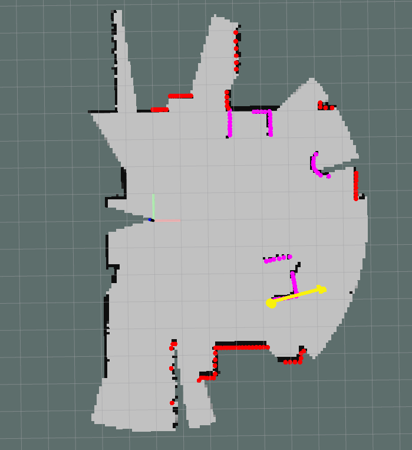

Quiz 5
======

General Information
------
To develop the quiz  symbolically link the [quiz5 folder](.) to your catkin_ws/src (ie if your quiz5 folder path is <git_repo_path>/quizzes/quiz5/) execute:

```bash
cd ~/catkin_ws/src
ln -s <git_repo_path>/quizzes/quiz5/
```
Compile with catkin_make, tests are compiled with `catkin_make tests` **NOTE plural in tests** 

```bash
cd ~/catkin_ws
catkin_make
catkin_make tests
```

In ROS to test our code we can supply a rosbag (a collection of data) that we have recorded and know "ground truth". To examine the rosbag that has been supplied for quiz5 a1 and a2 (we use same bag for both) close your project_setup (if you have it running) open a terminal and go to the bag folder using `roscd quiz5_a1/test/bag/`
Play the bag using `rosbag play -r 0.1 --clock -l sample.bag`
To view the data after playing use `rviz -d $(rospack find project_setup)/rviz/pfms.rviz`

 




Part A1
------

The task is to process laser data and extract useful information about the environments around us. In particular we are after information about high intensity readings as they present movable objects in this environment. High intensity readings have a intensity of 1.0, and RVIZ displays them in magenta (normal readings are red)

All of your programming will be in the [LaserProcessing Class](./a1/src/laserprocessing.h). This class is called from  Detection class, but we can also unit tests it independently by providing data for which we know the "ground truth", the exact output we are expecting.  To compile your unit tests `catkin_make tests`  (this command ONLY works from within catkin_ws folder). To run your your unit tests `rosrun quiz5_a1 quiz5_a1_test`

**TASK 1 - Count High Intensity Readings**

Count number of high intensity reading is a laser scan. High intensity readings the value `intensity` of 1.0 (greater than 0.5). 

As a reminder `rosmsg info sensor_msgs/LaserScan` will show you the `LaserScan` message, you will note that ranges and intensities are vectors and for each range you have the corresponding intensity at same location in the corresponding vector. Refer week 10 for examples of working with LaserScan data.

**TASK 2 - Count Number of High Intensity Segments**

Segments are formed by high intensity readings and they are
   * Consecutive high intensity readings
   * Less than 0.3m apart from each other (the Euclidian distance between successive points <0.3  )

The example image above has 5 segments.

**TASK 3 - Return Position of First High Intensity Reading**

The position should be the location of the first high intensity reading. The laser scans counterclockwise. 

As an example, below is the correct position (as well as pose for TASK 4 below)



**TASK 4 - Return a Pose at First High Intensity Reading**

The position should be on the first high intensity reading, while the the orientation should be towards the next 3 high intensity readings. 

Note, orientation is returned as a quaternion, and we looked at this in week 10. 

## Part A2

OccupancyGrid is used to indicate free space around the robot. You are developing code that would respond to a service, with a bool value indicating the global coordinate requested is within the OccupancyGrid. Thereafter every 5 seconds it will check if the global coordinate that was requested is still free within current OccupancyGrid, 

All of your programming will be in the [OgmapProcessing Class](./a2/src/ogmapprocessing.h). This class is called from  Detection class, but we can also unit tests it independently by providing data for which we know the "ground truth", the exact output we are expecting.  To compile your unit tests `catkin_make tests`  (this command ONLY works from within catkin_ws folder). To run your your unit tests `rosrun quiz5_a2 quiz5_a2_test`

**TASK 1 - Count Number of Uknown Cells**

Count number of free cells in current OccupancyGrid, unknws cells have a value of -1

As a reminder `rosmsg info rosmsg info nav_msgs/OccupancyGrid` will show you the `OccupancyGrid` message, you will note that data is encoded in a vectors (called data) and that we have metadata about the size of the map as well as origin (centre of map) location. Refer week 10 for examples of working with OccupancyGrid message.

**TASK 2 - Detect if position in OgMap is free**

You are provided a global position (location) and need to validate that this position is free in the OccupancyGrid. 

Note, the map has an origin (at the position of the robot) and is stored in OccupancyGrid message, while the position requested is in global coordinates. Therefore you need to convert the global position, onto a location within the OccupancyGrid and then find the cell (the actual grid) at that location.

