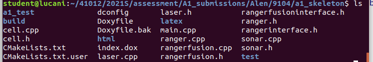

## Usage

Drop this folder **a1_test** into the area where your assignment code exists, example below, I've placed it with my code (you can see a1_test folder with my code)




Run the below commands from within the directory above. To explain we enter a1_test directory, we create a build directory and enter it, we cmake and then make all the unit test executables
```bash
cd a1_test
mkdir build
cd build
cmake ..
make
```

The list of tests is below, under **Full List of Tests**

If making all the tests fails (make reports error)  you can make then one at a time, an example of the syntax for angleTest  is below.

```bash
make angleTest
```

To run the test simply execute it, for instance for angleTest

```bash
./angleTest
```

## Full List of Tests

The list of tests is below and canvas has explanation of what the test does

```bash
advancedFusionTests
angleTest
getterSetter
invokeSensorData
laserFusionTest
multiSensorsTest
rangerFusionInterface
rangerInterface
rawRangeTest
rawTests
sensorConstructors
sensorOrderingTest
simpleFusionTests
sonarAreaTest
sonarFusionTest
```

Of course you can open qt-creator and the CMakeLists.txt inside a1_test and step through all the unit tets


## Pure Virtual

For pure virtual tests, you will need to run the following command from within the `a1_test/build` directory:
```bash
cmake .. --DCHECK_PURE_VIRTUAL=TRUE
make
./pureVirtualTests
```

This test should fail

