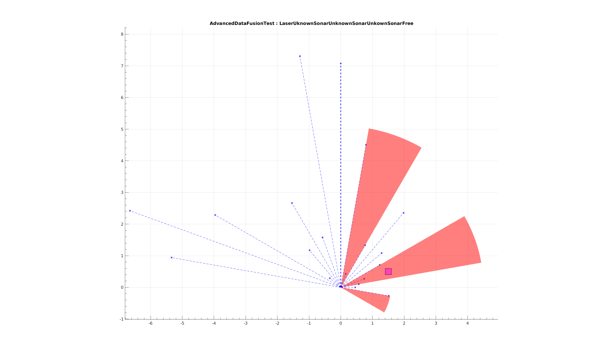
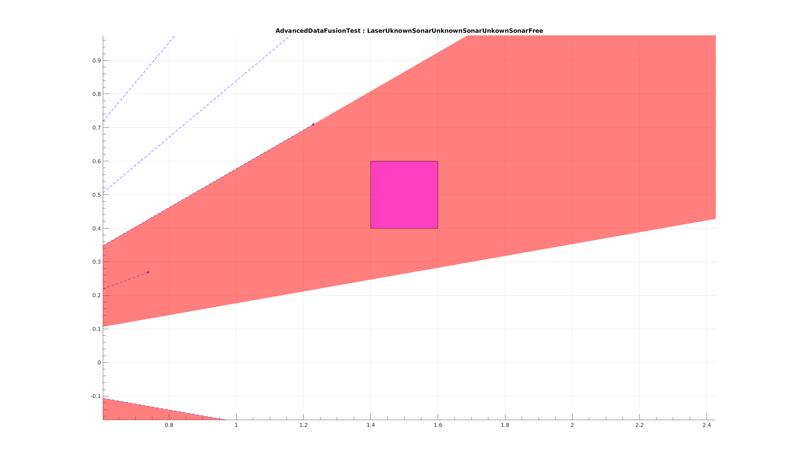

Week 8 Tutorial Questions
=========================
Work through these questions and make sure you understand what is going on in each example. If you have any questions about the material, please raise them in the next tutorial session.

We will use Google's C++ unit testing framework. A good starting point for using googletest is to read the [primer] document. 


Ex01 - Unit Testing 
===============================

In this example, we are testing the functionality of code according to specifications. We will be designing tests that test the code as per expected output, and using Assignment 1 as the example. We will be using a library built by one of your colleagues for Assignment 1 and testing it with the specifications at hand. You have been provided the compiled libraries [`cell` `rangers` and `fusion` in ./starter/ex01/dep/lib](./starter/ex01/dep/lib) and the header files that allow us to use the library [cell.h  laser.h  rangerfusion.h  rangerfusioninterface.h  ranger.h  rangerinterface.h  sonar.h  in ./starter/ex01/dep/include](./starter/ex01/dep/include). 

Task 1
-------

Examine the [utest_rawdata.cpp](./starter/ex01/test/utest_rawdata.cpp). The supplied unit test examines the `Sonar` class that was developed. 

What do the below two tests check for? Map the tests according to the marking criteria of Assignment 1.

The tasks to complete are

* The supplied tests only check for `Sonar`, implement the tests for `Laser`
* Implement the code to test for the fixed sensor parameters of `Sonar`

To run the unit tests, simply
``` 
make
./rawTests
```
Or it will also run with any tests we have by using
```
make test
```


Task 2
-------

Examine the [utest_fusion.cpp](./starter/ex01/test/utest_fusion.cpp). This unit test will test the fusion method in `RangerFusion`.

To do this test, we need to be able to supply to our sensors: data, angular resolution and offset to our sensors. Data for which we know the fusion outcome and we can then test the fusion in our code with respect to cell location.

In these situations, where data has to be supplied rather than obtained from the sensor, we leverage a concept called `Mock` class. `Mock` classes further abstract the sensor class, we utilise the concept of a `derived` class yet again to create another class on top of `Laser` and `Sonar` respectively, and allow us a capability to supply data directly (rather than have the sensor generate this data). This is done in any situation where you want the ability to generate data directly for testing purposes. We have supplied a [RangerMockLaser](./starter/ex01/mock/rangermocklaser.h) and [RangerMockSonar](./starter/ex01/mock/rangermocksonar.h) and you can find the implementation files as well (`cpp files`).

We will use the `Mock` classes to insert data into our sensors and use this data for our testing, as we can envisage an outcome for fusion.

We have a drawing of the envisaged configuration of sensors, sensor data and cell location. Please consider this and the existing `RangerMockLaser` configuration in [utest_fusion.cpp](./starter/ex01/test/utest_fusion.cpp)





The tasks to complete are:
- [ ] A) Examine how the Mock Laser is being constructed, see how position, angular resolution and data are supplied in RangerMockLaser.
- [ ] B) Construct three sonars with data that matches the supplied drawing using the syntax for the RangerMockSonar
- [ ] C) Create a cell as per the drawing
- [ ] D) Create fusion, supply cell, call the required functions for fusion to occur
- [ ] E) Compare the anticipated outcome against the fusion outcome in comparison (EXPECT_EQ)
- [ ] F) Create an additional test using the drawing and sensor data from the above test. HINT: Change the cell location, so its status becomes occupied, courtesy of laser interaction


**Outside of class, contemplate how you could test your Assignment 2**    


[primer]: https://github.com/google/googletest/blob/master/googletest/docs/primer.md
